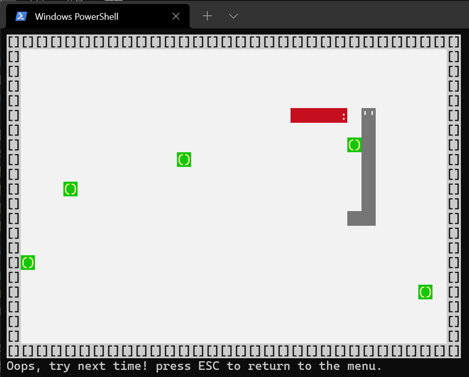

# SocketSnake

Software laboratory for XJTU course computer network, then implemented multiplayer snake game, with Rust.

## How to play

You can build it by yourself use `cargo run` after installed [Rust](https://www.rust-lang.org/). Also you can download a binary release of a specified platform.

Currently it supports all platforms as long as Rust supports it, but in Windows Subsystem of Linux, the user interaction may be poor because the program cannot access the keyboard events directly.

The menu of the game is a clear indication of what to do next. After you start the game (whether singleplayer or multiplayer), use keyboard controls:

 - `W A S D` or arrow keys to navigate
 - `Esc` to exit the game

When you are born on the field there would be a 1-second invulnerable time, and your snake will be blinking to identify its self.

When multiplayer gaming, there must be an instance of game that runs the server, and other clients in the local network shall join with the server's IP address.

## Dependencies

The user interaction of the game is based on [crossterm](https://github.com/crossterm-rs/crossterm), which is a text ui in terminals.

The concurrency and network implementations solely relys on `std` features, except getting the local ip address by [local_ipaddress](https://docs.rs/local_ipaddress/0.1.3/local_ipaddress/).

Transmitting control and display representations is dependent on [serde](https://docs.rs/serde/1.0.130/serde/#serde), and corresponding [serde_yaml](https://github.com/dtolnay/serde-yaml). The latest serde version has conflicts with crossterm, thus versions are specified in `Cargo.toml`.

## Milestones and todos

 - ~~Single player runnable~~
 - ~~Friendly UI~~
 - ~~In-game information board~~
 - ~~Multiplayer runnable~~
 - ~~Solve issues that client have leaked threads~~
 - Pondering multiple cases when panicking can do harm to user friendliness
 - Improve the performace of the server
 - Check whether the server will left the dispatched workers and connections leaked
 - Improve UDP performace